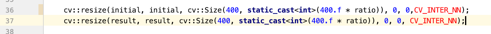
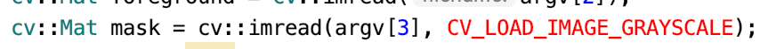
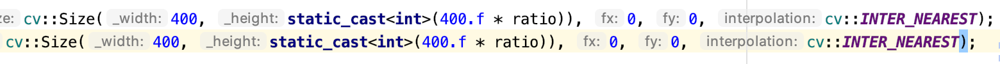
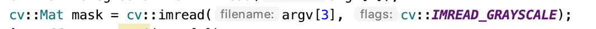
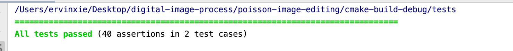
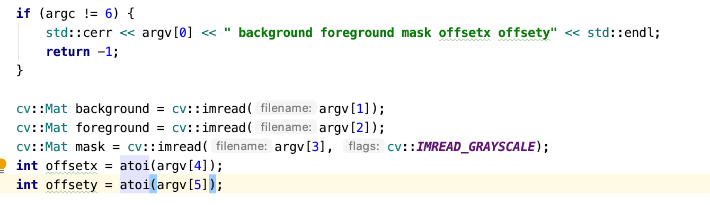
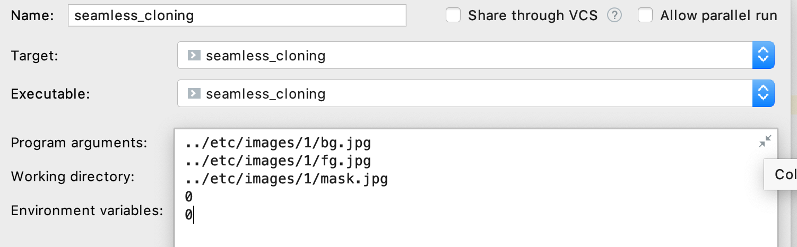
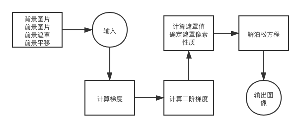

# 代码阅读实验报告
07111701班 1120172150 谢威宇

2020.1.24

## 实验环境
- macOS Catalina 10.15.2
- CLion 2019.3.3
- OpenCV 4.1.2
- Eigen 3.3.7

## 实验步骤 
- 首先下载代码到本地。
  ```bash
  git clone https://github.com/cheind/poisson-image-editing.git
  ```
  
- 使用CLion导入cmake项目

- 项目需要使用OpenCV和Eigen，进入命令行执行
	```bash
	brew install opencv
	brew install eigen
	```
	
- 安装完成后配置cmake文件
	```cmake
	set(CMAKE_CXX_STANDARD 11)
	set(EIGEN_INCLUDE_DIR "/usr/local/Cellar/eigen/3.3.7/include/eigen3")
	set(OpenCV_DIR /usr/local/Cellar/opencv/4.1.2/lib/cmake/opencv4)
	```
	
	由于我使用的是OpenCV 4以上的版本，所以需要c++11的特性支持。
	
- 由于版本更迭，发现代码中有一些老版本的宏定义，不能编译。

  例如tests/poisson.cpp中

  

  和example/seamless_clone.cpp中

  

  

  查询opencv文档之后予以更正

  

  

- 更正之后跑一下tests

  

  测试ok

- 打开/examples/seamless_cloning.cpp，阅读代码。

- 发现这个函数需要5个参数，分别为：背景图片，前景图片，遮罩，x轴移动和y轴移动。

  

- 打开Configuration菜单配置这些运行参数，使用它自带的样例图片，偏移量均设为0。

  

- 先运行，查看效果，显示的四张图片如下图。

  

## 整体分析和主要算法解读

- 继续阅读代码，首先使用一个result矩阵来存储所有的运算结果

  ```c++
cv::Mat result;
  ```

- 首先进行Naive CLone，我通过自己添加注释来说明代码的作用。

  ```c++
void naiveClone(cv::InputArray background_,
                  cv::InputArray foreground_,
                cv::InputArray foregroundMask_,
                  int offsetX, int offsetY,
                  cv::OutputArray destination_) {
      //获取背景，前景和前景遮罩的数据
      cv::Mat bg = background_.getMat();
      cv::Mat fg = foreground_.getMat();
      cv::Mat fgm = foregroundMask_.getMat();
      //在result矩阵中创建一个和背景尺寸一样的矩阵，用来存放结果
      destination_.create(bg.size(), bg.type());
      cv::Mat dst = destination_.getMat();
      //调用函数确定前景和背景的覆盖部分
      cv::Rect overlapAreaBg, overlapAreaFg;
      blend::detail::findOverlap(background_, foreground_, offsetX, offsetY, overlapAreaBg, overlapAreaFg);
      //复制背景
      bg.copyTo(dst);
      //复制前景到背景的指定部分，并且使用遮罩遮挡部分图像
      fg(overlapAreaFg).copyTo(dst(overlapAreaBg), fgm(overlapAreaFg));
  }
  ```
  
  发现它调用了
  ```c++
      blend::detail::findOverlap(background_, foreground_, offsetX, offsetY, overlapAreaBg, overlapAreaFg);
  ```
  于是查看该函数的定义。
  ```c++
namespace blend {
    
    namespace detail {
        bool findOverlap(cv::InputArray background,
                         cv::InputArray foreground,
                         int offsetX, int offsetY,
                         cv::Rect &rBackground,
                         cv::Rect &rForeground)
        {

            cv::Mat bg = background.getMat();
            cv::Mat fg = foreground.getMat();

            rBackground = cv::Rect(0, 0, bg.cols, bg.rows) & 
                          cv::Rect(offsetX, offsetY, fg.cols, fg.rows);
  					// Compensate for negative offsets. If offset < 0, offset in foreground is positive.
  					rForeground = cv::Rect(std::max<int>(-offsetX, 0), 
                                   std::max<int>(-offsetY, 0), 
                                   rBackground.width, 
                                   rBackground.height);
  
           return rForeground.area() > 0;            
        }
      ...
     }
    ...
  }
  ```
  
  发现它其实就是通过调用opencv的Rect类型的运算，计算出了背景和前景和重叠部分。
  
  总结naiveClone：这个方法其实确实就是一个naive的方法，计算重叠面积，然后复制过去就行了。
  
- 分析MIXED_GRADIENTS的方法：

  查看/src/clone.cpp的seamlessClone，发现它调用了。当然调用之前先计算了一下重叠矩形区域，
  ```c++
  detail::computeMixedGradientVectorField
  ```
  继续分析发现，其实这三种方法就是生成了不同的梯度值，然后采用生成的梯度值进行统一运算。
  
  继续查看相应代码，通过注释说明。
  
  ```c++
  void computeMixedGradientVectorField(cv::InputArray background,
                                               cv::InputArray foreground,
                                               cv::OutputArray vx_,
                                               cv::OutputArray vy_)
          {
  
              cv::Mat bg = background.getMat();
              cv::Mat fg = foreground.getMat();
              //返回矩阵通道数目
              const int channels = bg.channels();
  
              //创建输出矩阵
              vx_.create(bg.size(), CV_MAKETYPE(CV_32F, channels));
              vy_.create(bg.size(), CV_MAKETYPE(CV_32F, channels));
              
              cv::Mat vx = vx_.getMat();
              cv::Mat vy = vy_.getMat();
  
              //分别于建立x轴和y轴核
              cv::Mat kernelx = (cv::Mat_<float>(1, 3) << -0.5, 0, 0.5);
              cv::Mat kernely = (cv::Mat_<float>(3, 1) << -0.5, 0, 0.5);
              
              cv::Mat vxf, vyf, vxb, vyb;
              //对x和y方向进行卷积滤波，计算出对应的梯度
              cv::filter2D(fg, vxf, CV_32F, kernelx, cv::Point(-1,-1), 0, cv::BORDER_REPLICATE);
              cv::filter2D(fg, vyf, CV_32F, kernely, cv::Point(-1,-1), 0, cv::BORDER_REPLICATE);
              cv::filter2D(bg, vxb, CV_32F, kernelx, cv::Point(-1,-1), 0, cv::BORDER_REPLICATE);
              cv::filter2D(bg, vyb, CV_32F, kernely, cv::Point(-1,-1), 0, cv::BORDER_REPLICATE);
              
              
              //遍历每一个像素点的每一个通道
              for(int id = 0; id <= (vx.rows * vx.cols * channels - channels); ++id)
              {
                  //获取前景和背景关于此像素点的梯度
                  const cv::Vec2f g[2] = {
                      cv::Vec2f(vxf.ptr<float>()[id], vyf.ptr<float>()[id]),
                      cv::Vec2f(vxb.ptr<float>()[id], vyb.ptr<float>()[id])
                  };
                  
                  //取两梯度中，长度大的作为结果输出
                  int which = (g[0].dot(g[0]) > g[1].dot(g[1])) ? 0 : 1;
                  vx.ptr<float>()[id] = g[which][0];
                  vy.ptr<float>()[id] = g[which][1];
              }
          }
  ```
  
- 分析AVERAGED_GRADIENTS和FOREGROUND_GRADIENTS方法。

  发现这两个方法都调用的是同一个函数，区别在于最后一项weightForeground不一样。

  ```c++
  detail::computeWeightedGradientVectorField(background.getMat()(rbg),
                                                             foreground.getMat()(rfg),
                                                             vx, vy,
                                                             1.f);
    
  detail::computeWeightedGradientVectorField(background.getMat()(rbg),
                                                             foreground.getMat()(rfg),
                                                             vx, vy,
                                                             0.5f);
   
  ```

  这项参数代表了前景梯度在最终梯度输出中的比重。

  查看该函数，发现其和之前computeMixedGradientVectorField的不同之处在于把最后的遍历直接换成了按权值相加，得出按比例混合的梯度

  ```c++
  cv::addWeighted(vxf, weightForeground, vxb, 1.f - weightForeground, 0, vx);
  cv::addWeighted(vyf, weightForeground, vyb, 1.f - weightForeground, 0, vy);
  ```

- 计算出vx和vy之后，

  ```c++
          //继续求二阶梯度
          cv::Mat vxx, vyy;
          cv::Mat kernelx = (cv::Mat_<float>(1, 3) << -0.5, 0, 0.5);
          cv::Mat kernely = (cv::Mat_<float>(3, 1) << -0.5, 0, 0.5);
          cv::filter2D(vx, vxx, CV_32F, kernelx);
          cv::filter2D(vy, vyy, CV_32F, kernely);
          
          cv::Mat f = vxx + vyy;
  
          //获取二值遮罩
          cv::Mat boundaryMask(rfg.size(), CV_8UC1);
          cv::threshold(foregroundMask.getMat()(rfg), boundaryMask, constants::UNKNOWN, constants::DIRICHLET_BD, cv::THRESH_BINARY_INV);
          //加上边界条件
          cv::rectangle(boundaryMask, cv::Rect(0, 0, boundaryMask.cols, boundaryMask.rows), constants::DIRICHLET_BD, 1);
  
          //获取背景值
          cv::Mat boundaryValues(rfg.size(), CV_MAKETYPE(CV_32F, background.channels()));
          background.getMat()(rbg).convertTo(boundaryValues, CV_32F);
          
          //解泊松方程
          cv::Mat result;
          solvePoissonEquations(f,
                                boundaryMask,
                                boundaryValues,
                                result);
          
          // Copy result to destination image.
          result.convertTo(destination.getMat()(rbg), CV_8U);
  ```

- 那么现在重点来了，如何解泊松方程，得到图像的值。

  ```c++
  void solvePoissonEquations(
          cv::InputArray f_,
          cv::InputArray bdMask_,
          cv::InputArray bdValues_,
          cv::OutputArray result_)
      {
          //判断输入是否符合预期
          CV_Assert(
              !f_.empty() &&
              isSameSize(f_.size(), bdMask_.size()) &&
              isSameSize(f_.size(), bdValues_.size())
          );
          CV_Assert(
              f_.depth() == CV_32F &&
              bdMask_.depth() == CV_8U &&
              bdValues_.depth() == CV_32F &&
              f_.channels() == bdValues_.channels() &&
              bdMask_.channels() == 1);
  
          // 连续分布内存，提高效率
          cv::Mat f = makeContinuous(f_.getMat());
          cv::Mat_<uchar> bm = makeContinuous(bdMask_.getMat());
          cv::Mat bv = makeContinuous(bdValues_.getMat());
  
          // 给输出分布内存
          result_.create(f.size(), f.type());
          cv::Mat r = result_.getMat();
          bv.copyTo(r, bm == constants::DIRICHLET_BD);
  
          // 未知像素值的个数是遮罩中不符合狄利克雷边界条件的像素个数
          int nUnknowns = 0;
          // 计算个数，并返回像素索引
          cv::Mat_<int> unknownIdx = buildPixelToIndexLookup(bm, nUnknowns);
  
          if (nUnknowns == 0) {
              // 没有需要计算的像素了
              return;
          } else if (nUnknowns == f.size().area()) {
              // All unknowns, will not lead to a unique solution
              // TODO emit warning
          }
    			const cv::Rect bounds(0, 0, f.cols, f.rows);
  
          // 方向
          const int center = 0;
          const int north = 1;
          const int east = 2;
          const int south = 3;
          const int west = 4;
  
          // 方向增量
          const int offsets[5][2] = { { 0, 0 }, { 0, -1 }, { 1, 0 }, { 0, 1 }, { -1, 0 } };
          
          // 反方向目录
          const int opposite[5] = { center, south, west, north, east };
          const int channels = f.channels();
  
    	...
  		}
  		cv::Mat buildPixelToIndexLookup(cv::InputArray mask, int &npixel)
      {
          cv::Mat_<uchar> m = makeContinuous(mask.getMat());
  
          cv::Mat_<int> pixelToIndex(mask.size());
          npixel = 0;
          
          int *pixelToIndexPtr = pixelToIndex.ptr<int>();
          const uchar *maskPtr = m.ptr<uchar>();
          //遍历遮罩，判断是否为需要计算的像素，并加入索引
          for (int id = 0; id < (m.rows * m.cols); ++id) {
              pixelToIndexPtr[id] = (maskPtr[id] == constants::DIRICHLET_BD) ? -1 : npixel++;
          }
          return pixelToIndex;
      }
  ```

  准备工作完成之后，继续处理。遍历每一个像素

  ```c++
          std::vector< Eigen::Triplet<float> > lhsTriplets;
          lhsTriplets.reserve(nUnknowns * 5);
  
          Eigen::MatrixXf rhs(nUnknowns, channels);
          rhs.setZero();			
  
  				for (int y = 0; y < f.rows; ++y) {
              for (int x = 0; x < r.cols; ++x) {
  								//获取当前计算点的坐标
                  const cv::Point p(x, y);
                  const int pid = unknownIdx(p);
  
                  if (pid == -1) {
                      // 如果不是位置像素，则不需要计算，跳过
                      continue;
                  }
  
                  float lhs[] = { -4.f, 1.f, 1.f, 1.f, 1.f };
                  
                	// 这个Neumann边界条件在blend里面用到，在clone里面并没有用到
                  const bool hasNeumann = (bm(p) == constants::NEUMANN_BD);
                  
                  if (hasNeumann) {
                      // 这个Neumann边界条件在blend里面用到，在clone里面并没有用到
                    	// 跳过不分析
                  }
                  
                	//计算出各个像素点领域的影响
                  for (int n = 1; n < 5; ++n) {
                      const cv::Point q(x + offsets[n][0], y + offsets[n][1]);
                      
                      const bool hasNeighbor = bounds.contains(q);
                      const bool isNeighborDirichlet = hasNeighbor && (bm(q) == constants::DIRICHLET_BD);
                      
                      if (!hasNeumann && !hasNeighbor) {
                        	//如果不是边界点
                          lhs[center] += lhs[n];
                          lhs[n] = 0.f;
                      } else if (isNeighborDirichlet) {
                          // 是狄利克雷边界点
                          rhs.row(pid) -= lhs[n] * Eigen::Map<Eigen::VectorXf>(bv.ptr<float>(q.y, q.x), channels);
                          lhs[n] = 0.f;
                      }
                  }
  
  
                  // 把二阶引导场的值加上
                  rhs.row(pid) += Eigen::Map<Eigen::VectorXf>(f.ptr<float>(p.y, p.x), channels);             
                  for (int n = 0; n < 5; ++n) {
                      if (lhs[n] != 0.f) {
                          const cv::Point q(x + offsets[n][0], y + offsets[n][1]);
                          lhsTriplets.push_back(Eigen::Triplet<float>(pid, unknownIdx(q), lhs[n]));
                      }
                  }
              }
          }
  				// 解这个稀疏线性方程
          Eigen::SparseMatrix<float> A(nUnknowns, nUnknowns);
          A.setFromTriplets(lhsTriplets.begin(), lhsTriplets.end());
  
          Eigen::SparseLU< Eigen::SparseMatrix<float> > solver;
          solver.analyzePattern(A);
          solver.factorize(A);
  
          Eigen::MatrixXf result(nUnknowns, channels);
          for (int c = 0; c < channels; ++c)
              result.col(c) = solver.solve(rhs.col(c));
          // 把结果拷贝回去
          for (int y = 0; y < f.rows; ++y) {
              for (int x = 0; x < f.cols; ++x) {
                  const cv::Point p(x, y);
                  const int pid = unknownIdx(p);
  
                  if (pid > -1) {
                      Eigen::Map<Eigen::VectorXf>(r.ptr<float>(p.y, p.x), channels) = result.row(pid);
                  }
              }
          }
  
  ```

  就这样完成了seamless cloning中遮罩像素值的计算。

## 算法流程图



## 模块功能和接口说明

和seamless cloning有关的就三个模块，分别为seamless_cloning.cpp、clone.cpp和poisson_solver.cpp三个模块。

seamless cloning多次调用clone中seamlessClone函数，通过传入不同的参数来确定引导场的计算类型，调用完成之后得到计算好的图片。

clone自己的seamlessClone按照不同引导场类型调用自己的函数，计算完成之后返回。然后调用poisson solver解泊松方程，得到解之后返回给seamless cloning。

poisson solver就单独解泊松方程就完成任务了。


