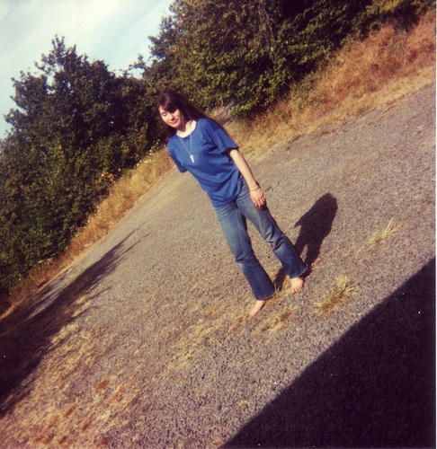

# 高级图像分割实验报告
07111701班 1120172150 谢威宇 
2020.1.30
## 实验环境
- macOS Catalina 10.15.2
- PyCharm 2019.3.2
- Python 3.7.4
- numpy 1.17.2
- OpenCV 4.1.2
- Pillow 7.0.0
- numba 0.48.0
## 实验描述
本实验实现了三个图像分割算法——kmeans，区域增长和分水岭算法，并编写了用户界面方便用户调整参数、预览效果和保存图片。工程使用python实现。算法实现的关键过程没有调取第三方。


## 实验代码
代码分装在两个文件，main.py和segmentation.py。main.py负责管理GUI界面，解决文件读写和处理用户输入，segmentation.py负责分割算法的实现。main.py处理好的图片和参数以numpy数组的形式传递给segmentation.py的分割函数，segmentation.py将处理好的图片返回给main.py呈现给用户方便后续操作

### main.py
```python
import tkinter as tk
import numpy as np
from tkinter import *
from tkinter.filedialog import askopenfilename, asksaveasfile
import tkinter.messagebox
from PIL import ImageTk
import PIL.Image
from segmentation import *

w = 1500
h = 800
midwidth = 180
picwidth = (w - midwidth) / 2 - 10
picheight = h - 50

root = tk.Tk()
root.title('图像分割')
root.geometry('{}x{}'.format(w, h))
root.resizable(False, False)

origin = None
origin_name = None
result = None

# 显示图片时缩放到适合大小
def resize_to(im, w, h):
    iw = im.size[0]
    ih = im.size[1]

    dw = iw / w
    dh = ih / h
    if dw > dh:
        return im.resize((int(w), int(w / iw * ih)))
    else:
        return im.resize((int(h / ih * iw), int(h)))

# 设置源图片
def set_ori(label):
    selected = askopenfilename()
    if selected == '':
        return
    img_open = PIL.Image.open(selected)
    global origin, origin_name
    origin = np.array(img_open)
    origin_name = selected.split('/')[-1]

    img = ImageTk.PhotoImage(resize_to(img_open, picwidth, picheight))

    label.config(image=img)
    label.image = img  # keep a reference

# 设置输出图片
def set_out(label):
    img_re = PIL.Image.fromarray(result)
    img = ImageTk.PhotoImage(resize_to(img_re, picwidth, picheight))
    label.config(image=img)
    label.image = img

# 保存图片
def save_pic():
    if result is None:
        tk.messagebox.showerror(title='注意', message='没有待保存的图片')
        return
    fname = asksaveasfile(initialfile=origin_name)
    img = PIL.Image.fromarray(result)
    img.save(fname)
    tk.messagebox.showinfo(title='注意', message='图片保存成功')

# GUI
fs = [Frame(root, height=h, width=[picwidth, midwidth, picwidth][i], border=2) for i in range(3)]
for i, f in enumerate(fs):
    f.grid_propagate(False)
    f.grid(row=0, column=i)
    if i == 1:
        continue
    f.grid_rowconfigure(0, weight=1)
    f.grid_rowconfigure(3, weight=1)
    f.grid_columnconfigure(0, weight=1)
    f.grid_columnconfigure(2, weight=1)

pic_ori = Label(fs[0])
pic_ori.grid(row=1, column=1)
Button(fs[0], text='选择图片', command=lambda: set_ori(pic_ori)).grid(row=2, column=1)

pic_out = Label(fs[2])
pic_out.grid(row=1, column=1)
Button(fs[2], text='保存图片', command=lambda: save_pic()).grid(row=2, column=1)

Button(fs[1], text='K聚类', command=lambda: process('kmeans')).pack()
Label(fs[1], text='在下方填写k值').pack()
kmeans_k = Entry(fs[1])
kmeans_k.pack()
Button(fs[1], text='区域增长', command=lambda: process('rGrowth')).pack()
Label(fs[1], text='在下方填写区域阈值').pack()
rg_tresh = Entry(fs[1])
rg_tresh.pack()
Button(fs[1], text='分水岭', command=lambda: process('dam')).pack()
Label(fs[1], text='在下方填写灰度容差').pack()
eps = Entry(fs[1])
eps.pack()

# 决定采用哪一种处理方法
def process(method):
    if origin is None:
        tk.messagebox.showerror(title='注意', message='没有加载图片')
    else:
        if method == 'kmeans':
            k = kmeans_k.get()
            if k == '':
                k = 5
            else:
                try:
                    k = int(k)
                except ValueError:
                    tk.messagebox.showerror(title='注意', message='请填写正确的k值')
                    return
                if k <= 0:
                    tk.messagebox.showerror(title='注意', message='请填写正确的k值')
                    return
                elif k > 16:
                    tk.messagebox.showerror(title='注意', message='k不能超过16')
                    return
            res = kmeans(im=origin, k=k)

        elif method == 'rGrowth':
            t = rg_tresh.get()
            if t == '':
                t = 0.03
            else:
                try:
                    t = float(t)
                except ValueError:
                    tk.messagebox.showerror(title='注意', message='请填写正确的k值')
                    return
            res = regionGrow(im=origin, threshold=t)
        elif method=='dam':
            e = eps.get()
            if e == '':
                e = 0.03
            else:
                try:
                    e = float(e)
                except ValueError:
                    tk.messagebox.showerror(title='注意', message='请填写正确的k值')
                    return

            res = dam(im=origin,EPS=e)
        global result
        result = res
        set_out(pic_out)


root.mainloop()
```

###segmentation.py 
```python
import numpy as np
import cv2 as cv
import numba
from numba import jit
import queue
from sklearn.cluster import MeanShift, estimate_bandwidth
from PIL import Image


def find_centroid(data, k):
    dim = data.shape[1]
    # 先随机生成一些聚类中心
    cen = np.random.rand(k, dim)

    # 迭代求解
    while True:
        # 只需计算欧式距离的平方
        dis = np.sum((np.expand_dims(data, axis=1) - np.expand_dims(cen, axis=0)) ** 2, axis=-1)

        # 计算类别
        cate = np.argmin(dis, axis=1)
        ncen = cen.copy()

        for i in range(k):
            # 计算同类别的新均值
            ncen[i] = np.average(data[np.where(cate == i)], axis=0)
            # 如果有任何点都不属于的情况，则新随机生成一个点
            if np.any(np.isnan(ncen[i])):
                ncen[i] = np.random.rand(dim)
        # 如果两次结果一样，则达到停止循环条件
        if np.all(np.abs(cen - ncen) < 1e-4):
            break
        else:
            cen = ncen
    # 返回聚类中心
    return cen


def kmeans(im, k=2):
    im = im.astype(np.float64) / 255
    ch = im.shape[-1]
    cen = find_centroid(im.reshape(-1, ch), k)
    nim = im.copy()
    dis = (np.expand_dims(nim, 2) - np.expand_dims(cen, (0, 1))) ** 2
    dis = np.sqrt(np.sum(dis, axis=-1))
    cate = np.argmin(dis, axis=-1)
    nim = cen[cate] * 255
    nim = nim.astype(np.uint8)
    return nim


# 区域增长算法，通过一个栈实现深度优先搜索
def regionGrow(im, threshold=0.03):
    im = im.astype(np.float64) / 255
    dir = np.array([[1, 0], [-1, 0], [0, 1], [0, -1]])
    vis = np.zeros((im.shape[0], im.shape[1]), dtype=np.int32)

    q = queue.LifoQueue()

    cnt = 1
    avcs = []
    for i in range(im.shape[0]):
        for j in range(im.shape[1]):
            if vis[i, j] == 0:
                vis[i][j] = cnt
                q.put(np.array([i, j]))

                avsum = np.zeros_like(im[i, j])
                avcnt = 0
                while not q.empty():
                    u = q.get()
                    avcnt += 1
                    avsum += im[u[0], u[1]]
                    avc = avsum / avcnt
                    np.random.shuffle(dir)
                    an = dir + u
                    an = an[np.where(an[:, 0] >= 0)]
                    an = an[np.where(an[:, 1] >= 0)]
                    an = an[np.where(an[:, 0] < im.shape[0])]
                    an = an[np.where(an[:, 1] < im.shape[1])]
                    for v in an:
                        if np.square(avc - im[v[0], v[1]]).sum() < threshold and vis[v[0], v[1]] == 0:
                            q.put(v)
                            vis[v[0], v[1]] = cnt
                avcs.append(avsum / avcnt)
                cnt += 1

    avcs = np.array(avcs)
    nim = avcs[vis - 1]
    # print(cnt)
    # cnt -= 1
    # for i in range(cnt):
    #     i += 1
    #     nim[np.where(vis == i)] = np.average(nim[np.where(vis == i)], axis=0)

    print(vis)
    return (nim * 255).astype(np.uint8)


# 分水岭算法
def dam(im, EPS=0.05):
    im = im.astype(np.float64) / 255
    print(im.shape)
    gray = np.dot(im[..., :3], [0.2989, 0.5870, 0.1140])
    print(gray.shape)

    idx = np.argsort(gray, axis=None, kind='stable')
    idx = np.array([idx // im.shape[1], idx % im.shape[1]]).T
    print(idx.shape)

    vis = np.zeros_like(gray, dtype=np.int32)
    dir = np.array([[1, 0], [-1, 0], [0, 1], [0, -1]])

    last = -1
    cnt = 1

    for u in idx:
        an = dir + u
        an = an[np.where(an[:, 0] >= 0)]
        an = an[np.where(an[:, 1] >= 0)]
        an = an[np.where(an[:, 0] < im.shape[0])]
        an = an[np.where(an[:, 1] < im.shape[1])]
        vset = set()
        for v in an:
            if gray[v[0], v[1]] + EPS < gray[u[0], u[1]] and vis[v[0], v[1]] != 0 and vis[v[0], v[1]] != -1:
                vset.add(vis[v[0], v[1]])
        size = len(vset)
        if size >= 2:  # 如果是分水岭则设为-1
            vis[u[0], u[1]] = -1
        elif size == 1:
            vis[u[0], u[1]] = vset.pop()
        elif size == 0:
            vis[u[0], u[1]] = cnt
            cnt += 1
        if vis[u[0], u[1]] == 0:
            print(u)

    nim = gray.copy()
    nim[np.where(vis == -1)] = 1

    print(vis)
    return (nim * 255).astype(np.uint8)
```

## 实验结果

原图




K均值算法的分类结果，这个地方K取值为6，可以发现这个算法其实对空间边界没有那么敏感，它把最接近的颜色分为一类，导致有很多微小起伏也被分开了。


区域增长算法的分割结果，这个算法中区域增长的边界值为0.05。可以发现仍然还有些许噪点。


区域增长算法边界值为0.1的结果。看上去要好多了，清晰地分割出了图像的主体部分。


分水岭算法的结果。由于分水岭算法是对灰度图像处理较多，所以图像为灰色。图中白色的点为分水岭界线。可以发现虽然分水岭算法能够将图像的各个部分分开，但是由于图像一般局部最小值都比较多，导致出现过分割的情况。


接下来是实验的GUI介绍。

首先是是基本界面


然后是选择一个图片加载，这里我们选择in.jpg


接着我们填写参数然后点击相应的算法按钮进行处理。


等待片刻后出现分割的结果。


对结果感到满意之后，点击保存图片，选择图片保存的路径和文件名。


提示保存成功


## 实验总结
本实验实现了三个图像分割领域的算法。这三个算法的实现过程各有难度，也很有意思。由于使用python实现，所以性能有所欠缺。因此我尽可能调用numpy来加速运算，关键函数使用numba进行加速，最后也得到了不错的效果。

可以发现其实三种算法中，对于彩色图像还是区域增长算法较为优秀。对于特定的黑白图像，分水岭算法效果也颇为不错。在调试过程中，我曾想到是否可以通过合并小的分割来解决分水岭算法过分割的问题。但遗憾的是由于时间和精力原因，未能实现。

现阶段图像语义分割最厉害的算法是基于神经网络的算法。我也曾花了一定的时间了解了UNet等基于神经网络的算法并加以训练。其实本实验调试所用图片均来自于著名的Pascal VOC2012数据集。由于时间和计算机性能问题，并未取得很好成果，故在此没有展示。

图像分割是一现今CV方向三大问题中最困难的一个，同时它也非常有趣。今后我也会继续尝试进行图像分割方面的学习。感谢老师布置这样的作业引领我们了解这样的一个领域。

