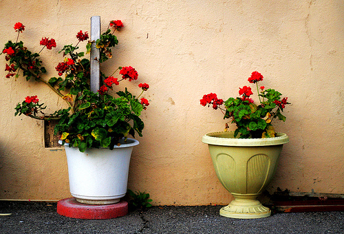
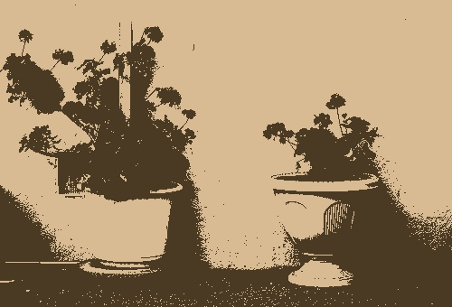
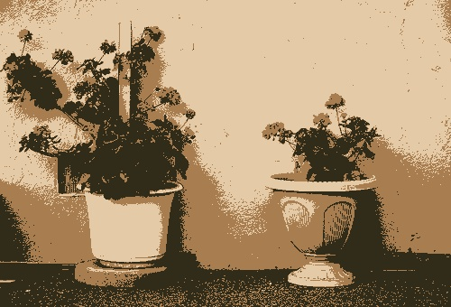
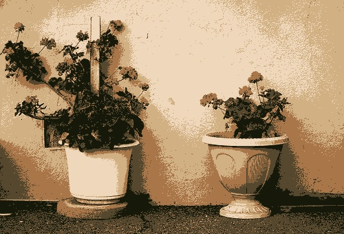
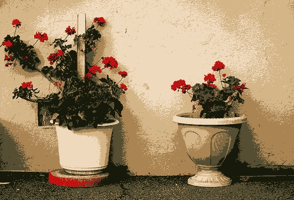
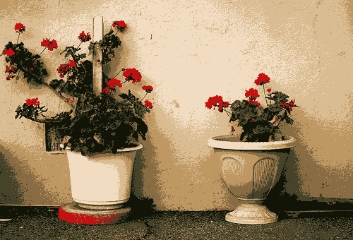
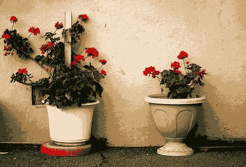
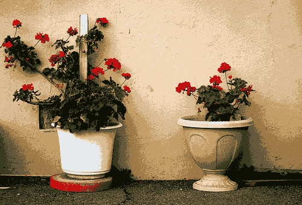
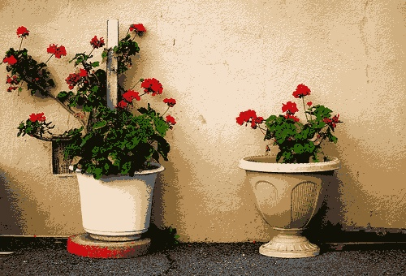

# 图像分割实验报告
07111701班 1120172150 谢威宇

2020.1.14

## 实验环境
- macOS Catalina 10.15.2
- PyCharm 2019.2.2
- Python 3.7.4
- numpy 1.17.2
- OpenCV 4.1.2

##实验描述
使用K均值算法对彩色图像进行分割。具体做法是在RGB空间中对像素颜色进行聚类，之后再将同一个聚类的像素赋值为聚类中心的颜色。

## 实验代码

```python
import numpy as np
import cv2 as cv


def kmeans(data, k):
    dim = data.shape[1]
    # 先随机生成一些聚类中心
    cen = np.random.rand(k, dim)

    # 迭代求解
    while True:
        # 计算欧式距离
        dis = (np.expand_dims(data, axis=1) - np.expand_dims(cen, axis=0)) ** 2
        dis = np.sqrt(np.sum(dis, axis=-1))

        # 计算类别
        cate = np.argmin(dis, axis=1)
        ncen = cen.copy()

        for i in range(k):
            # 计算同类别的新均值
            ncen[i] = np.average(data[np.where(cate == i)], axis=0)
            # 如果有任何点都不属于的情况，则新随机生成一个点
            if np.any(np.isnan(ncen[i])):
                ncen[i] = np.random.rand(dim)
        # 如果两次结果一样，则达到停止循环条件
        if np.all(cen == ncen):
            break
        else:
            cen = ncen
    # 返回聚类中心
    return cen


def segmentation(path,k=2):
    im = cv.imread(path).astype(np.float64) / 255
    cen = kmeans(im.reshape(-1, 3), k)
    nim = im.copy()
    dis = (np.expand_dims(nim, 2) - np.expand_dims(cen, (0, 1))) ** 2
    dis = np.sqrt(np.sum(dis, axis=-1))
    cate = np.argmin(dis, axis=-1)
    nim = cen[cate]
    cv.imshow('nim', nim)
    cv.imwrite('out{}.jpg'.format(k), nim*255)
    cv.waitKey(0)

for x in range(2,11):
    segmentation('in.jpg',x)


```

## 实验结果

原图


2聚类


3聚类


4聚类


5聚类


6聚类可以发现这个聚类效果比较好，很明显地区分了红花、绿叶和墙体。


7聚类


8聚类


9聚类


10聚类，效果也不错，但是聚类之间的分割就不是那么明显。



做完实验可以发现，其实这种方法的聚类更像是进行了一次风格化降低色阶。不过对于一些特点场景来说，K均值聚类还是能起到一些较好的效果。