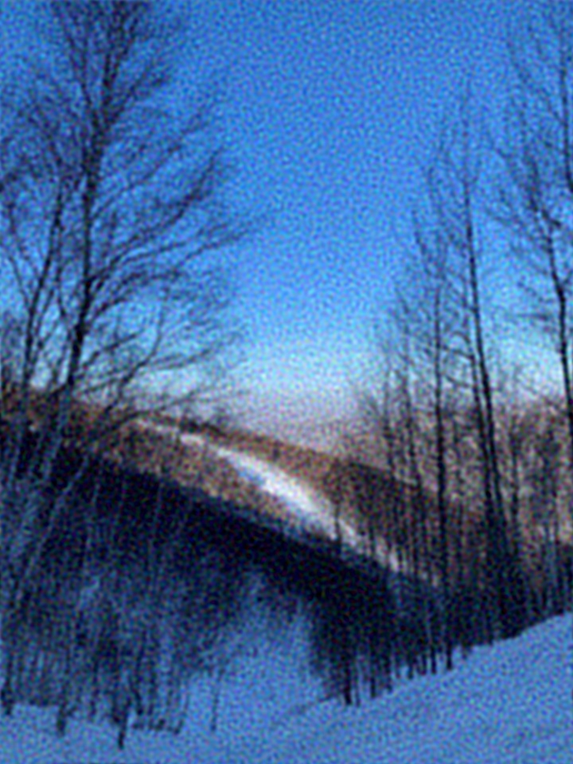

# 维纳滤波实验报告
07111701班 1120172150 谢威宇
2020.1.5
## 实验环境
- Windows 10
- PyCharm 2019.2.2
- Python 3.7.4
- numpy 1.17.2
- OpenCV 4.1.2
## 实验描述
对一幅图像先进行高斯滤波和高斯噪声处理，再进行维纳滤波去噪声。本实验实现了对多通道彩色图片的处理。

## 实验代码

```python
import numpy as np
import cv2 as cv
from scipy import signal


# 给一个size，返回对应的高斯核
def gaussian_kern(size=6, std=1):
    if type(size) == tuple:
        gx = signal.gaussian(size[0], std=std).reshape(size[0], 1)
        gy = signal.gaussian(size[1], std=std).reshape(size[1], 1)
    else:
        gx = signal.gaussian(size, std=std).reshape(size, 1)
        gy = np.copy(gx)
    re = np.outer(gx, gy)
    return re / np.sum(re)


# 高斯模糊
def gaussian_blur_fft(im, std=3):
    imf = np.fft.fft2(im, axes=(0, 1))

    k = gaussian_kern((im.shape[0], im.shape[1]), std)
    kf = np.fft.fft2(k)
    kf = np.expand_dims(kf, 2)

    nim = imf * kf
    nim = np.fft.ifftshift(np.fft.ifft2(nim, axes=(0, 1)), axes=(0, 1)).real

    return nim


# 高斯噪声
def noise(im, std=0.5):
    im += np.random.randn(im.shape[0], im.shape[1], im.shape[2]) * std
    return im


# 预估维纳滤波中信噪比的倒数
def estimate_snr(im, std=0.5):
    n = np.random.randn(im.shape[0], im.shape[1], im.shape[2]) * std
    return np.sum(n ** 2) / np.sum(im ** 2)


# 维纳滤波
def weiner_filt(im, std=3):
    snr = estimate_snr(im, 0.1)
    print(snr)
    imf = np.fft.fft2(im, axes=(0, 1))
    H = gaussian_kern((im.shape[0], im.shape[1]), std)
    H = np.fft.fft2(H)
    G = np.conjugate(H) / (np.conjugate(H) * H + snr)
    G = np.expand_dims(G, 2)
    nim = imf * G
    nim = np.fft.ifftshift(np.fft.ifft2(nim, axes=(0, 1)), axes=(0, 1)).real
    return nim


# 读取图片
im = cv.imread('in.jpg').astype(np.float64) / 255
# 加高斯模糊
im = gaussian_blur_fft(im, 5)
# 加高斯噪声
im = noise(im, 0.1)
# 显示并存储模糊图片
cv.imshow('im', im)
cv.waitKey(0)
cv.imwrite('blurred.jpg',im*255)
# 维纳滤波
im = weiner_filt(im, 5)
# 显示并存储滤波之后的图片
cv.imshow('im', im)
cv.waitKey(0)
cv.imwrite('out.jpg', im * 255)


```

## 实验结果

原图


加上高斯模糊和高斯噪声的图片


维纳滤波之后的图片


虽然完成了实验要求，但是其实我认为维纳滤波效果并不是很好。当然也有可能是本来图像的信息就已经丢失许多导致难以还原。

